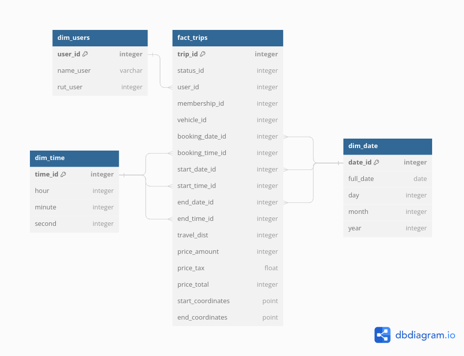

# Respuestas Test Data Engineer

### 1. Diseñar un modelo de datos. Genere una propuesta sobre cómo guardar los datos. Justifique esa propuesta y explique por qué es la mejor opción.

**Respuesta:** Se propone un modelo de datos tipo estrella, representado por el siguiente diagrama:

En este modelo se destacan los siguientes aspectos:

- Se incluye en la tabla de hechos `fact_trips` todos los IDs asociados a sus dimensiones, junto con las mediciones de distancia recorrida, precio, y coordenadas.
- Los atributos `name_user` y `rut_user` se incluyen sólo en la dimensión `dim_users`
- Los atributos asociados a timestamps se separan en fecha y hora, y se codifican en sus respectivas tablas de dimensión `dim_date` y `dim_time`.

Los principales fundamentos para la elección de esta arquitectura son los siguientes:

- Facilita el entendimiento de cómo se encuentran estructurada la data y cómo los campos se relacionan entre sí
- Simplificación de queries en comparación a modelos de datos más normalizados al requerir menos JOINs. Esto resulta particularmente importante en este caso, ya que se desea utilizar esta data para analítica
- Mayor flexibilidad que modelos de datos del tipo One Big Table, especialmente en el caso de requerir modificar alguna dimensión (por ejemplo, en caso de que un usuario modifique su nombre, sólo será necesario modificar una única fila de la tabla `dim_user`, en vez de modificar una gran cantidad de filas de la tabla `fact_trips`). Esto también se aplica a las tablas de fecha y hora, ya que facilita la implementación de nuevas agrupaciones de fecha, como por semestre, trimestre, semana, etc.
- La separación de fecha y hora en tablas distintas permite disminuir el número de filas de esta dimensión (ya que no estamos guardando 1 fila para cada combinación fecha-hora posible). Además, la existencia de una tabla separada para la hora permite facilitar el cálculo de algunos indicadores que podrían ser valiosos para procesos de analítica futuros, como por ejemplo los cálculos asociados a determinar las horas *peak* de uso. (Nota: en general estas tablas de dimensión poseen muchos otros campos que pueden ayudar con la obtención de indicadores, pero para efectos de este ejercicio se utilizó una versión simplificada por razones de tiempo).

### 2. Crea una base de datos en Postgres usando Docker.

**Respuesta:** En este repositorio viene incluido un archivo `docker-compose.yml`. Ejecutarlo mediante el comando `docker-compose up -d` en la raíz de este repositorio. Esto levantará la base de datos Postgres en el puerto 5432 del localhost. Para efectos de este ejercicio, se utilizaron varias configuraciones por defecto de la imagen por razones de tiempo. Además, como los datos que se desean cargar poseen información espaciodimensional, se utilizará la imagen docker de `postgis` para facilitar el manejo de estos datos.

### 3. Crea las tablas del modelo de datos que diseñaste en el paso 1. Puede usar scripts SQL o código en Python.

**Respuesta:** En la carpeta `entrypoint-scripts` se encuentra el script SQL `create_populate_tables.sql`, el cual crea las tablas del modelo de datos y luego rellena las tablas `dim_date` y `dim_time` con un rango de fechas relevantes para el archivo que se cargará en la parte 4.

### 4. Genera archivos en Python para cargar los datos del archivo trips.csv en las tablas que creaste en el paso anterior.
**Respuesta:** En la raíz del repositorio se encuentra el jupyter notebook `load_data.ipynb`. Este archivo contiene todo el código Python utilizado para cargar el archivo .csv y poblar las tablas `dim_users` y `fact_trips` con la data extraída. Para ejecutarse correctamente, este notebook requiere las librerías pandas, geopandas, psycopg2, sqlalchemy, y geoalchemy2.

### 5. Cree una nueva tabla en Postgres llamada resumen_diario.
1. Genera con Python un proceso de ETL que cargue en la tabla un resumen por día de la cantidad de viajes, los suma de ingresos, el promedio de ingresos, y la suma de metros recorridos. Explique y justifique las decisiones que tomó para generar el resumen. Considere que diariamente no habrá más de 100.000 viajes.

	**Respuesta:** En la raíz del repositorio se encuentra el notebook `resumen_diario.ipynb`. Este archivo extrae los datos de viajes realizados durante un día en la tabla `fact_trips`, los agrupa para calcular los indicadores solicitados, y carga la fila resultante en la tabla `resumen_diario`. Esta última tabla contiene columnas para todos los indicadores, junto con una columna adicional de fecha que indica a qué día corresponde el registro calculado.

    Para esta parte, se asumió que para contabilizar los viajes, sus ingresos, y su distancia recorrida, se consideraría la fecha de fin del viaje. Esto debido a que lo más probable es que las columnas de ingresos y distancia recorrida no reciben valores hasta que el viaje del usuario finaliza. En un contexto productivo normal, esta decisión se conversaría con los analistas que desean explotar esta data para determinar el criterio que más se acomoda a sus requerimientos. Sin embargo, como en este ejercicio no es posible realizar este paso, se trabajó con el supuesto mencionado anteriormente.

    Además, es importante destacar que para este proceso, se optó por trabajar el cálculo de los indicadores mediante pandas y queries SQL. Esta opción se eligió dado que es la alternativa más simple de implementar y que garantiza un funcionamiento eficiente para el volumen de datos que se desea procesar (100.000 registros diarios como máximo).
2. Señale (sin necesidad de implementar) qué procesos podría desarrollar para asegurar la consistencia de los datos en la tabla resumen_diario.

    **Respuesta:** Con la solución actualmente implementada, ya se pueden encontrar ciertos procesos que ayudan a mantener la consistencia de los datos. Entre ellos destacan:
    - Existencia de PKs en la tabla `fact_trips` y preprocesamiento en el script `load_data.ipynb` asegura limpieza de registros duplicados y datos inválidos (asociados a campos importantes con valores nulos)
    - La arquitectura basada en la creación de data marts a partir del data warehouse diseñado en la parte 1. permite establecer consistencia a lo largo de todas las tablas futuras que se desee construir para procesos de analística, ya que todas podrán construirse a partir del mismo repositorio centralizado.
    
    Adicionalmente, se proporne implementar los siguientes procesos para aumentar la consistencia de los datos:
    - Establecer un criterio de gobierno de datos que permita identificar dueños de la data, junto con protocolos de manejo de la data que permitan asegurar la calidad de la data. Esto es especialmente importante para campos críticos como los relacionados a ingresos.
    - Implementar procesos automatizados que midan la calidad de la carga. Estos procesos pueden medir criterios como el número total de registros cargados, el número de registros que no pudieron ser cargados debido a algún error, y la fecha a partir de la cual los datos se disponibilizaron en la BD.
    - Implementar procesos automatizados que midan la calidad de los campos relevantes. Por ejemplo, verificar que las distancias e ingresos insertados en cada carga se encuentren dentro de los límites normales de operación, o quizás realizar alguna validación cruzada con otras fuentes de datos en caso de existir.
3. Señale (sin necesidad de implementar) cómo podría automatizar este proceso de ETL de manera diaria.
    
    **Respuesta:** Este proceso se puede automatizar mediante el uso de algún orquestador, como por ejemplo Apache Airflow. Mediante este orquestador, se puede definir un DAG que ejecute paso a paso cada etapa del ETL definido. La principal ventaja del uso de estas herramientas es que permite automatizar la ejecución de los procesos mediante una recurrencia definida (por ejemplo, ejecutar 1 vez al día en una hora específica), junto con además permitir la definición de rutinas de monitoreo y alerta en caso de encontrar algún error en la ejecución.

### 6. La empresa quiere implementar un sistema de descuentos mediante cupones. ¿Cómo modificarías el modelo de datos para agregarlo? Describa su propuesta, justifique y explique por qué es la mejor opción. No es necesario que lo implemente.
**Respuesta:** Se realizarían las siguientes modificaciones:
1. Se agregaría una nueva tabla de dimensión al data warehouse `dim_descuento`, la cual almacene la información de todos los cupones disponibles (ID del cupón, tipo de descuento, porcentaje de descuento, fecha de validez, acumulable, etc.).
2. Se agregaría una columna opcional (o sea, acepta valores NULL) a la tabla `fact_trips` que indique el ID del cupón que el usuario utilizó para su viaje, en caso de haber ocupado alguno. Esta columna actuaría como Foreign Key y estaría asociada a la tabla `dim_descuento`

Se plantea que esta sería la mejor opción para el Data Warehouse diseñado, ya que permite conservar los beneficios de la arquitectura estrella del modelo de datos. Principalmente, permite añadir una dimensión adicional a la data de viaje sin tener que modificar en gran medida la tabla `fact_trips`, que es la tabla más costosa de modificar. Además, este diseño también facilita operaciones de modificación de cupones (por ejemplo, añadir un nuevo tipo de cupón o extender el periodo de validez de un descuento existente).
